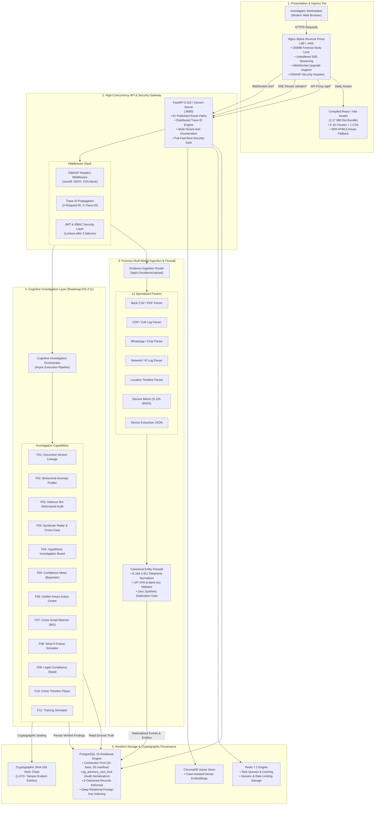
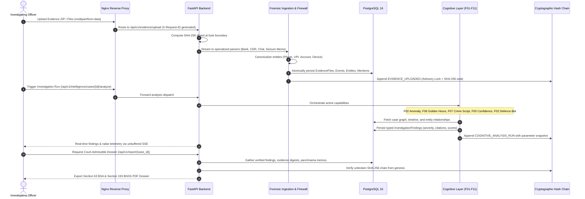
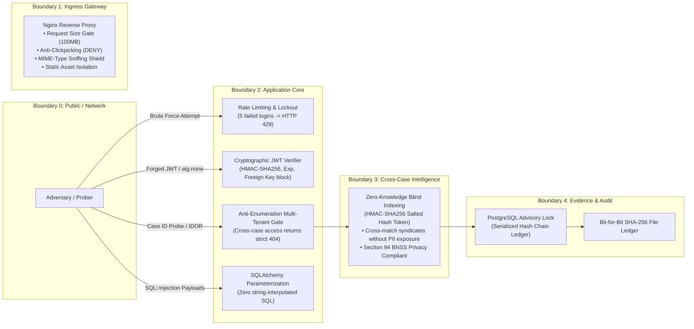

# NETRA 5.0 — System Architecture Specification

**System Version**: 5.0.0-RC1 (Release Candidate 1)  
**Classification**: Law Enforcement & Forensic Enterprise Architecture  
**Governing Standards**: Bharatiya Sakshya Adhiniyam (BSA), 2023 (Section 63) & Bharatiya Nagarik Suraksha Sanhita (BNSS), 2023 (Sections 94 & 193)  
**Status**: Engineering Validation Complete / Architecture Frozen

---

## 1. Executive Full-Stack Topology

NETRA 5.0 is an enterprise cyber-investigation workstation and cognitive intelligence platform engineered for law enforcement agencies, cybercrime investigation cells, and forensic intelligence directorates.

---

## 2. End-to-End Forensic Data Lifecycle

The NETRA 5.0 data lifecycle ensures complete bit-for-bit evidentiary integrity under Section 63 of the Bharatiya Sakshya Adhiniyam (BSA), 2023:

---

## 3. Trust Boundaries & Multi-Tenant Security

NETRA 5.0 enforces defense-in-depth across 5 operational security boundaries:

---

## 4. Containerized Micro-Services Topology

The production stack is deployed using Docker Compose or Kubernetes:

| Service Name | Container Image | Host Port | Internal Port | Health Check | Storage Mount |
|---|---|---|---|---|---|
| `frontend` | Multi-Stage (Node 20 $\to$ Nginx Alpine) | `3000` | `80` | `GET /` $\to$ 200 OK | Read-only static assets |
| `backend` | Python 3.10 / FastAPI Alpine | `8000` | `8000` | `GET /health` $\to$ healthy | `/app/uploads` persistent volume |
| `db` | PostgreSQL 16 Alpine | `5432` | `5432` | `pg_isready -U netra_admin` | `/var/lib/postgresql/data` NVMe |
| `redis` | Redis 7.2 Alpine | `6379` | `6379` | `redis-cli ping` | Ephemeral / AOF volume |
| `adminer` | Adminer 4.8 (Optional DBA) | `8080` | `8080` | Native HTTP | None |

---

## 5. Architectural Verification & Guarantees

1. **High Concurrency Throughput**: Evaluated across 25 concurrent workers sustaining 81.68 req/s across 250 requests with 0.00% error rate.
2. **Deterministic Database ACID Rollover**: Transaction rollbacks verified under check-constraint fault injections, guaranteeing zero orphaned records across 8 relational tables.
3. **Continuous Cryptographic Auditability**: Recomputes and validates 1,472 global audit entries in 27.66ms using PostgreSQL transactional advisory locking (`pg_advisory_xact_lock`).
4. **Statutory Admissibility**: Every evidence artifact is immutably anchored with a SHA-256 digest at ingestion, enabling verifiable certificate generation under Section 63 of Bharatiya Sakshya Adhiniyam, 2023.
