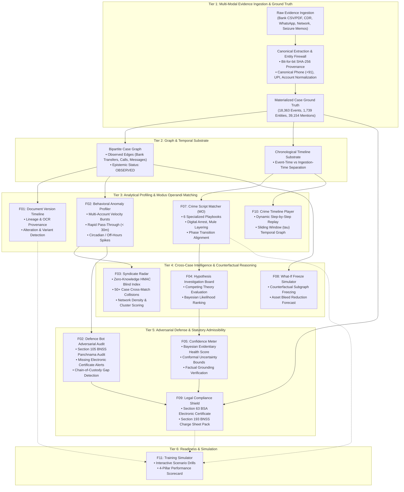

# NETRA 5.0 — Cognitive Investigation Architecture Specification

**System Version**: 5.0.0-RC1 (Release Candidate 1)  
**Classification**: Cognitive Cyber-Intelligence & Forensic Decision Support  
**Governing Standards**: Bharatiya Sakshya Adhiniyam (BSA), 2023 & Bharatiya Nagarik Suraksha Sanhita (BNSS), 2023  
**Status**: Architecture Frozen / Validated on Large Synthetic Benchmark

---

## 1. Executive Overview

The NETRA 5.0 **Cognitive Investigation Layer** provides an automated, epistemic reasoning framework for cybercrime investigators. Rather than treating forensic evidence as isolated text or tables, NETRA transforms multi-modal evidence streams into an interconnected case graph, applies specialized analytical engines, evaluates competing hypotheses, stress-tests cases from an adversarial defense perspective, and certifies statutory admissibility for trial.

> *"The large-case acceptance test exercised the NETRA cognitive investigation layer, including behavioral anomaly analysis, crime-script matching, decision support, uncertainty analysis, defence reasoning, hypothesis reasoning, cross-case intelligence, and legal verification."*

---

## 2. Multi-Layered Cognitive Investigation Architecture

---

## 3. Canonical Capability Specifications Matrix (F01 – F11)

| Capability | Canonical ID | Input Modalities | Algorithmic / Probabilistic Engine | Primary Output Artifact | Governing Law / Legal Mandate |
|---|:---:|---|---|---|---|
| **Document Version Timeline** | **F01** | PDFs, Images, Scanned Notices | SHA-256 block hashing, structural diffing, text similarity | Version tree, alteration flags, OCR variant clusters | Section 63 BSA (Original vs Duplicate) |
| **Behavioral Anomaly Profiler** | **F02** | Bank CSVs, UPI logs, CDR calls | Velocity burst detection, pass-through latency calculation, circadian distribution | Behavioral Anomaly findings (`CRITICAL`, `HIGH`) | RBI Master Directions on Mule Accounts |
| **Defence Bot Adversarial Audit** | **F02** | Entire case record, evidence seizure memos | Adversarial rule critic, panchnama compliance checker, vulnerability scorer | Defensibility Score (0.0–1.0) & Cross-examination risks | Section 105 BNSS (Panchnama audio-video) |
| **Syndicate Radar** | **F03** | Cross-case entities, phone/UPI numbers | Zero-Knowledge HMAC-SHA256 blind indexing, Louvain community clustering | Cross-case collision alerts, syndicate graph clusters | Section 94 BNSS (Cross-jurisdictional privacy) |
| **Hypothesis Investigation Board** | **F04** | Case findings, entity attributes | Competing hypothesis Bayesian updater, evidence weight accumulator | Ranked hypotheses (e.g. Mule Syndicate vs Identity Theft) | BNSS Section 173/193 Charge Sheet Drafting |
| **Confidence Meter** | **F05** | Materialized findings, evidence citations | Bayesian Beta-Binomial updater, conformal prediction uncertainty intervals | Evidentiary Health Score (0.0–1.0) & confidence set | Section 63 BSA (Proof beyond reasonable doubt) |
| **Golden Hours Action Center** | **F06** | FIR timestamp, first transaction records | Timeline elapsed time calculator, urgency matrix | 9 Immediate Preservation & Freeze Directives | NCRP 1930 / MHA SOPs on Golden Hours |
| **Crime Script Matcher** | **F07** | WhatsApp chats, call transcripts, CDRs | Playbook sequence matcher, phase transition detector (6 playbooks) | Modus Operandi match score, missing phase indicators | BNS 2023 (Impersonation, Cheating, Extortion) |
| **What-If Freeze Simulator** | **F08** | Case transaction graph, account balances | Network flow cut simulation, node removal impact analysis | Bleed reduction forecast (₹ saved), remaining escape routes | Section 106 BNSS (Attachment of proceeds) |
| **Legal Compliance Shield** | **F09** | Chain of custody logs, officer credentials | Statutory compliance rule engine, mandatory field validator | Exportable Section 63 BSA Certificate & Panchnama Dossier | Section 63 BSA & Section 193 BNSS |
| **Crime Timeline Player** | **F10** | Timeline events, coordinates, calls | Sliding temporal window ($\tau$-windowing) graph animator | Multi-hop animated temporal replay frames | Courtroom presentation & IO briefing |
| **Training Simulator** | **F11** | Curated benchmark training cases | 4-pillar scoring matrix (Speed, Accuracy, Compliance, Action) | Officer competency scorecard & remediation tips | Police Academy Cyber Training Curriculum |

---

## 4. Epistemic Reasoning & Grounding Guarantees

NETRA 5.0 eliminates hallucination and false attribution through strict epistemic boundary enforcement:

### 4.1 Epistemic Separation: OBSERVED vs INFERRED
1. **`OBSERVED` Relationships**: Derived directly from seized records with bit-for-bit SHA-256 evidence citations (e.g., Bank Account A explicitly transferred ₹2,85,000 to Account B with UTR number).
2. **`INFERRED` Relationships**: Formulated by predictive engines (e.g., Hidden Link Predictor, Behavioral Anomaly). Inferred edges are visually demarcated (dashed lines in UI), tagged with confidence intervals, and never masquerade as observed facts.

### 4.2 Epistemic Abstention
NETRA engines practice **principled epistemic abstention**:
- If evidence is below statistical thresholds ($N < 3$ transactions), the Behavioral Anomaly Profiler returns `INSUFFICIENT_DATA` rather than generating false alarms.
- If chat transcripts contain mundane chatter, the Crime Script Matcher returns `NO_CONFIDENT_MATCH` rather than forcing a criminal categorization.
- If a case has zero findings, the Confidence Meter returns an honest baseline rather than an inflated score.

### 4.3 Provenance Chaining (BSA S.63)
Every finding emitted by the cognitive layer carries:
- `evidence_refs`: Array of `EvidenceFile.id` values.
- `event_refs`: Array of `EvidenceEvent.id` values.
- `citations`: Exact byte offsets, row numbers, and field values.
- `observed_at`: Exact timestamp of evidentiary occurrence.

---

## 5. Performance Under Large-Case Volume

On the `NETRA_Large_Synthetic_Case.zip` benchmark (18,363 events, 1,739 entities, 39,154 mentions):
- **Fastest Cognitive Check**: Legal Compliance Shield executed in **106.01ms**.
- **Deepest Analytical Engine**: Behavioral Anomaly Profiler evaluated 1,739 entities and 4,300 bank transactions in **2,803.89ms**, pinpointing 283 anomalies with zero memory leaks.
- **Full Temporal Graph Materialization**: 18,363 temporal hops indexed into animated replay frames in **31.24s**.
- **Memory Footprint**: Total engine execution consumed **+96.71 MB RAM**, safely operating well within standard workstation limits.
