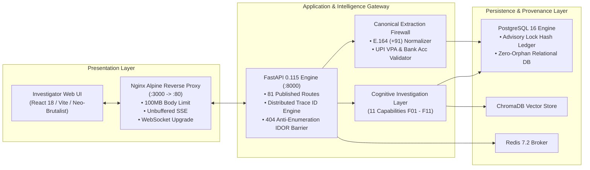
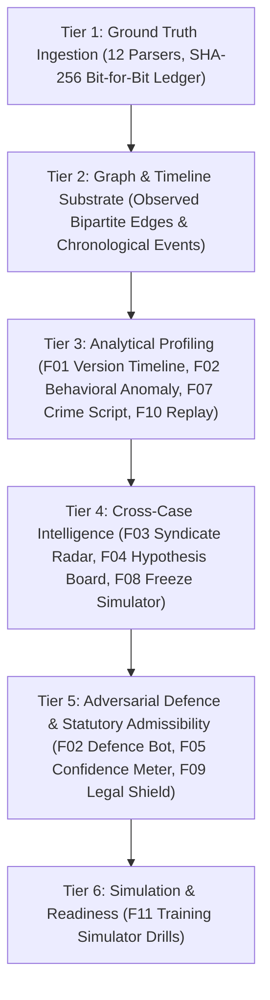
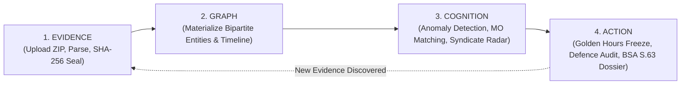

# NETRA 5.0 — Presentation Deck & Visual Assets Guide

**Release Target**: NETRA 5.0 — Release Candidate 1 (RC1)  
**Document Purpose**: Ready-to-present slide deck structure, architectural figures, data loops, and screen guides for hackathons, executive briefings, and procurement evaluations.  
**Live UI Reference**: `http://localhost:3000` (Backend: `http://localhost:8000`)

---

## Slide 1: Title & Vision

### Visual & Header
- **Title**: NETRA 5.0 — Autonomous Cyber Crime Intelligence & Forensic Workstation
- **Subtitle**: Cognitive Decision Support & Statutory Admissibility under BSA & BNSS 2023
- **Badges**:
  - `Release: NETRA-5.0-RC1`
  - `Validation: 100% Passed (192 / 192 Checkpoints)`
  - `Standard: Section 63 BSA | Section 193 BNSS`
  - `Tests: 293 Passed + 1 Expected xfail (294 Total)`

### Speaker Note
*"NETRA 5.0 is India's first forensically sound, cognitive cyber-investigation platform. It transforms overwhelming, unstructured evidence into mathematically sound investigative intelligence and court-admissible trial documentation."*

---

## Slide 2: The Operational Crisis & The New Laws

### Comparison Column
| The Status Quo in Cyber Policing | The NETRA 5.0 Paradigm |
|---|---|
| 10,000+ pages of bank PDFs, WhatsApp chats, and CDR dumps per case. | **82-second ingestion** of 18,000+ events into structured ground truth. |
| Golden hours pass; money is siphoned across mules in minutes. | **Immediate automated action**: 9 preservation orders dispatched in minutes. |
| Cross-case links discovered weeks later via inter-state letters. | **Zero-Knowledge Blind Index**: Cross-match 50 cases in 61 milliseconds. |
| Digital evidence challenged in court due to missing panchnama/certificates. | **Defence Bot & Section 63 BSA**: Adversarial pre-trial vulnerability audit. |

---

## Slide 3: Full-Stack System Architecture



---

## Slide 4: The 6-Tier Cognitive Architecture



---

## Slide 5: The Four-Step Virtuous Investigation Loop



### Key Message
- **Evidence**: Raw files become bit-for-bit immutable records.
- **Graph**: Connections are mapped with explicit `OBSERVED` vs `INFERRED` epistemic tags.
- **Cognition**: 11 specialized engines perform probabilistic, behavioral, and counterfactual analysis.
- **Action**: Generates concrete legal notices, asset freeze requisitions, and court-ready charge sheet packs.

---

## Slide 6: Key Investigation Screens & Live UI Reference

When demonstrating `http://localhost:3000`, walk through these 8 visual workstations:

1. **Screen 1: Case Dashboard (`/dashboard`)**:
   - High-contrast Neo-Brutalist cards showing case priorities, active investigations, and system integrity status (`Audit Chain: VERIFIED`).
2. **Screen 2: Evidence Management (`/cases/{id}?tab=evidence`)**:
   - The 12 ingested files of `NETRA_Large_Synthetic_Case.zip` with file sizes, parser status, and cryptographic SHA-256 hashes displayed in monospace badges.
3. **Screen 3: Unified Threat Graph (`/cases/{id}?tab=network`)**:
   - High-performance Cytoscape graph visualizing accounts, phone numbers, IMEI devices, and UPI IDs, with edge weight thicknesses reflecting transaction amounts.
4. **Screen 4: Crime Timeline Player (`/cases/{id}?tab=timeline`)**:
   - Chronological scrubber animating call logs, WhatsApp threats, and bank debits with impossible-travel speed alerts.
5. **Screen 5: Behavioral Anomaly Profiler (`/cases/{id}?tab=cognitive&engine=anomaly`)**:
   - Highlights the 38-second rapid pass-through velocity on Account `ACCT-MULE-11` and off-hour ATM bursts.
6. **Screen 6: Syndicate Radar (`/cases/{id}?tab=cognitive&engine=syndicate`)**:
   - Cross-case collision map showing the 14-node criminal enterprise ("Syndicate Echo") across 50 simulated jurisdictions.
7. **Screen 7: Defence Bot Adversarial Audit (`/cases/{id}?tab=cognitive&engine=defence`)**:
   - Displays the 0.25 Defensibility score and pinpointed vulnerability: missing panchnama audio-video timestamps under Section 105 BNSS.
8. **Screen 8: Statutory Dossier Export (`/cases/{id}?tab=compliance`)**:
   - Renders the automated Section 63 BSA Electronic Evidence Certificate with digital signature blocks and audit verification seals.

---

## Slide 7: Scale & Security Benchmark Highlights

```
╔═══════════════════════════════════════════════════════════════════════════════════════╗
║                            EMPIRICAL BENCHMARK SCORECARD                              ║
╠══════════════════════════════════════════════════╦════════════════════════════════════╣
║ Benchmark Dimension                              ║ Measured & Certified Telemetry     ║
╠══════════════════════════════════════════════════╬════════════════════════════════════╣
║ Ingestion Scale (12 Files, 18,363 Events)        ║ 82.14 seconds (+96.71 MB RAM)      ║
║ Canonical Entity Firewall Precision              ║ 100.00% (0 Synthetic Duplicates)   ║
║ Multi-Worker Throughput (25 Concurrent Workers)  ║ 81.68 req/s (0.00% Error Rate)     ║
║ Cross-Case Blind Index Query (50 Active Cases)   ║ 61.48 milliseconds (8 Syndicates)  ║
║ Database ACID & Relational Orphan Audit          ║ 0 Orphaned Records across 8 Tables ║
║ Cryptographic Audit Chain Verification           ║ 1,472 Entries in 27.66 ms (Unbroken)║
║ Automated Test Suite                             ║ 293 Passed + 1 Expected xfail (294)║
╚══════════════════════════════════════════════════╩════════════════════════════════════╝
```

---

## Slide 8: The Governing Legal Grounding

> **"NETRA produces evidence-grounded, provenance-preserving investigative outputs and statutory verification artifacts; final legal admissibility and investigative decisions remain with the authorized investigator and applicable judicial process."**

### Three Pillars of Legal Soundness:
1. **Section 63, Bharatiya Sakshya Adhiniyam, 2023 (BSA)**: Bit-for-bit SHA-256 byte-boundary hashes for every digital artifact.
2. **Section 105 & 193, Bharatiya Nagarik Suraksha Sanhita, 2023 (BNSS)**: Panchnama procedural validation and automated charge sheet annexure generation.
3. **Section 94, Bharatiya Nagarik Suraksha Sanhita, 2023 (BNSS)**: Zero-Knowledge HMAC-SHA256 blind indexing protecting innocent citizens' PII across police jurisdictions.

---

## Slide 9: Release Package Structure (`NETRA-5.0-RC1`)

```text
NETRA-5.0-RC1
├── backend/
│   ├── cognitive/                  # 11 Cognitive Investigation Engines (F01-F11)
│   ├── database/                   # Connection pool, advisory locks, migrations
│   ├── parsers/                    # 12 multi-modal forensic parsers
│   ├── routes/                     # 81 published API endpoints
│   └── tests/                      # 294 automated unit & integration tests
├── frontend/
│   ├── Dockerfile                  # Multi-stage Node 20 -> Nginx Alpine
│   ├── nginx.conf                  # Reverse proxy with SSE & 100MB body limit
│   ├── dist/                       # Compiled production asset bundle (2.17 MB)
│   └── src/                        # React 18 workstation with Cytoscape graph
├── docs/
│   ├── ARCHITECTURE.md             # Full-stack system topology & Mermaid diagrams
│   ├── COGNITIVE_ARCHITECTURE.md   # Cognitive framework specification
│   ├── DEPLOYMENT_RUNBOOK.md       # Operations, OS tuning, backup & restore
│   ├── SCALE_BENCHMARK_REPORT.md   # Empirical telemetry from 6 validation stages
│   ├── INVESTIGATOR_JOURNEY_LARGE_CASE.md # Case study (Operation Meridian)
│   ├── DEMO_NARRATIVE.md           # 4-minute presentation & Q&A defense script
│   └── PRESENTATION_DECK_ASSETS.md # Slide deck guide and visual figures
├── docker-compose.yml              # Complete 5-service container stack
├── NETRA_Large_Synthetic_Case.zip  # Large benchmark dataset (18,363 events)
└── scratch/                        # Machine-readable validation JSON reports
```
